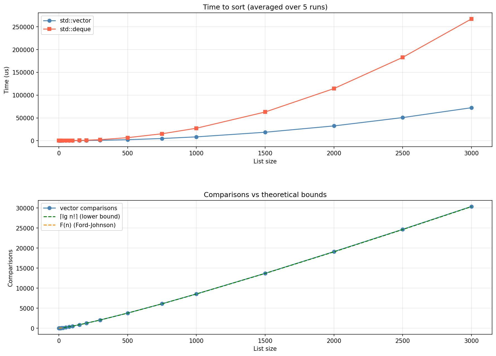

# PmergeMe

Implementation of the Ford-Johnson merge-insertion sort algorithm in C++98, applied to both `std::vector` and `std::deque`.

## Usage

```bash
./PMergeMe 3 5 9 7 4 2 1
```

```
Before: 3 5 9 7 4 2 1
Sorted: 1 2 3 4 5 7 9
Time to process a range of 7 elements with std::vector : 12.00 us
Time to process a range of 7 elements with std::deque  : 8.00 us
```

## Algorithm

Ford-Johnson (merge-insertion sort) is a comparison-based sorting algorithm that minimizes the number of comparisons. It was published by Ford and Johnson in 1959 and remains one of the most comparison-efficient sorting algorithms known.

### Steps

1. **Pair** adjacent elements and compare each pair — the larger element wins
2. **Recurse** on the winners to sort them
3. **Insert** the losers (pend elements) back into the sorted chain using binary insertion, in Jacobsthal order to minimize comparisons

### Jacobsthal order

The pend elements are not inserted left-to-right. Instead they follow the Jacobsthal sequence `1, 3, 2, 5, 4, 11, 10, 9, 8, 7, 6, ...` which ensures each insertion uses at most `k` comparisons for a group of size `t_k - t_{k-1}`.

### Orphan

When the input has odd size, the last element is set aside as an orphan. It is added to the pend at the end of the round with no upper bound constraint (full chain search).

### Complexity

`F(n)` is the worst-case number of comparisons for Ford-Johnson. `⌈lg n!⌉` is the information-theoretic lower bound — no comparison sort can do better.

```
F(n) = ⌈lg n!⌉            for n = 1..11, 20, 21    → provably optimal
F(n) = ⌈lg n!⌉ + epsilon  for most other n         → a little above optimal
```

This is confirmed by the results table below: `max` tracks `F(n)` exactly, and for n=1..11, 20, 21 it equals `⌈lg n!⌉` directly.

## Results

### Comparison count (1000 runs per size)

```
size   min      mean     max      F(n)     lg(n!)   sorted
------ -------- -------- -------- -------- -------- ------------
1      0        0        0        0        0        OK
2      1        1        1        1        1        OK
3      2        2        3        3        3        OK
4      4        4        5        5        5        OK
5      6        6        7        7        7        OK
6      8        9        10       10       10       OK
7      10       12       13       13       13       OK
8      13       15       16       16       16       OK
9      16       18       19       19       19       OK
10     20       21       22       22       22       OK
11     23       25       26       26       26       OK
12     27       29       30       30       29       OK
13     28       32       34       34       33       OK
14     33       36       38       38       37       OK
15     36       40       42       42       41       OK
16     40       44       46       46       45       OK
17     44       48       50       50       49       OK
18     49       52       54       54       53       OK
19     53       57       58       58       57       OK
20     57       61       62       62       62       OK
21     62       65       66       66       66       OK
22     67       70       71       71       70       OK
23     71       74       76       76       75       OK
24     76       79       81       81       80       OK
25     80       84       86       86       84       OK
26     83       88       91       91       89       OK
27     89       93       96       96       94       OK
28     94       98       101      101      98       OK
29     99       103      106      106      103      OK
30     102      108      111      111      108      OK
31     108      113      116      116      113      OK
32     113      118      121      121      118      OK
33     118      123      126      126      123      OK
```

### Time vs list size

<p align="center">
  
</p>

## Implementation notes

- `std::vector` and `std::deque` versions run independently with separate comparison counters
- Jacobsthal sequence is precomputed once at construction for the full input size
- Upper bound for binary insertion is found via linear search in the current chain
- Duplicate values are handled correctly via a `used[]` flag when rebuilding the pend

## Files

| File | Description |
|------|-------------|
| `PmergeMe.hpp` | Class definition |
| `PmergeMe.cpp` | Sort implementation |
| `main.cpp` | Argument parsing and entry point |
| `bench.py` | Python benchmark — time and comparisons graph |
| `test.sh` | Bash test — comparison count stats vs F(n) |

## Bibliography

Knuth, D.E. — *The Art of Computer Programming, Volume 3: Sorting and Searching*, section 5.3.1, p.184
https://seriouscomputerist.atariverse.com/media/pdf/book/Art%20of%20Computer%20Programming%20-%20Volume%203%20(Sorting%20%26%20Searching).pdf